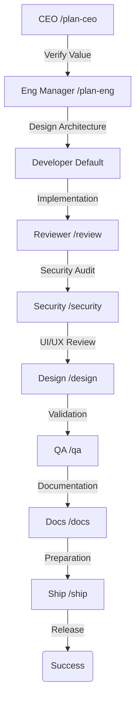

# GStack for OpenCode 🚀

[](LICENSE)
[](Makefile)
[](https://opencode.ai/)
[](CONTRIBUTING.md)

> **The ultimate multi-agent AI programming team, powered by OpenCode.**  
> Porting Garry Tan's GStack methodology with "Best-of-Breed" model selection and advanced tool-use capabilities.

---

[English](#english) | [中文](#chinese)

<a name="english"></a>

## 🌐 Overview

**GStack for OpenCode** transforms your AI from a single assistant into a **Dynamic Expert Team**. By leveraging OpenCode's agentic framework, it assigns specialized roles to the most suitable LLMs (Claude, Gemini, DeepSeek, Kimi), creating a workflow that outperforms single-model tools like Claude Code in complex, long-term engineering tasks.

### ✨ Key Features

- **🛡️ Multi-Model Mastery**: Use **Claude 3.5 Sonnet** for logic, **Gemini 1.5 Pro** for architecture (2M context), and **DeepSeek/Kimi** for cost-effective reasoning.
- **⚔️ Advanced Tool-Use**: Agents are unlocked with `bash` (shell execution), `webfetch` (real-time research), and `edit` (file modification) capabilities.
- **🧩 Zero Context Pollution**: Each role runs in an isolated agent session, ensuring critical architectural decisions aren't diluted by implementation details.
- **🇨🇳 Domestic Ready**: First-class support for DeepSeek, Kimi, and Zhipu GLM via OpenAI-compatible endpoints.

## 🏗️ Workflow Architecture



## ⚖️ Why GStack? (Pros & Cons)

### 🚀 What Problems Does It Solve?

1.  **Context Pollution**: Single-model sessions often get "confused" by previous implementation details. GStack isolates high-level architecture from low-level coding.
2.  **High Costs**: Stop using expensive Claude 3.5 for simple unit tests. Offload tasks to **DeepSeek** or **GPT-4o mini**.
3.  **Vendor Lock-in**: Claude Code is locked to Anthropic. GStack gives you the freedom to swap models mid-flow.
4.  **Domestic Barrier**: Native support for Chinese developers using DeepSeek, Kimi, and GLM without VPN hurdles.

### ✅ Pros
- **Specialized Intelligence**: Each role uses the model that excels at that specific task (e.g., Gemini for long-context architecture).
- **Autonomous Tool-Use**: Agents can now run `bash` to explore your codebase and `webfetch` to research external documentation.
- **Structured Workflow**: Forces a "Think-Design-Code-Verify" cycle, significantly reducing technical debt.
- **Open Source & Extensible**: Easily add your own roles (e.g., `DBA`, `DevOps`) via Markdown templates.

### ⚠️ Cons (Current Limitations)
- **Setup Overhead**: Requires manual environment variable configuration for domestic models (due to OpenCode CLI bugs).
- **Dependency**: Performance is tied to the stability of the OpenCode CLI and chosen model's tool-calling capability.
- **Learning Curve**: Users need to understand the "Role-playing" concept to get the best results.

## 🎭 The Expert Team

| Role | Command | Tool-set | Core Mission |
|:---|:---|:---|:---|
| **CEO** | `/plan-ceo` | 🌐 Web | Product vision, MVP scope, and business value verification. |
| **Eng Manager** | `/plan-eng` | 💻 Bash, 🌐 Web | Technical architecture, system boundaries, and tech-stack selection. |
| **Reviewer** | `/review` | 💻 Bash, 📝 Edit | Critical bug hunting, performance optimization, and logic review. |
| **Security** | `/security` | 💻 Bash, 🌐 Web | Vulnerability scanning, privacy audit, and security hardening. |
| **Designer** | `/design` | 🌐 Web | UI/UX consistency, accessibility (A11y), and user flow optimization. |
| **QA** | `/qa` | 💻 Bash, 📝 Edit | Edge-case testing, test generation, and automated bug fixing. |
| **Docs** | `/docs` | 📝 Edit, 🌐 Web | README auditing, API documentation, and technical writing. |
| **Ship** | `/ship` | 💻 Bash | Release checklists, CHANGELOG generation, and rollback planning. |

## 🚀 Quick Start

### 1. Installation

```bash
# Clone the repository
git clone https://github.com/yandong2023/gstack-opencode.git && cd gstack-opencode

# Install agents, commands and skills
make install

# Validate your environment
make validate
```

### 2. Domestic Model Configuration (DeepSeek/Kimi)

If you are using domestic models, we recommend the **Environment Variable Workaround** to bypass CLI configuration bugs:

```bash
# Add to your .zshrc or .bashrc
export OPENAI_API_KEY="your-deepseek-api-key"
export OPENAI_BASE_URL="https://api.deepseek.com/v1"
```

### 3. Usage

Enter your project directory and start the magic:
```bash
opencode
/plan-ceo "I want to add a real-time notification system."
```

---

<a name="chinese"></a>

## 🌐 概述

**GStack for OpenCode** 将你的 AI 从单一助手转变为一支 **动态专家团队**。通过利用 OpenCode 的 Agent 框架，它将专门的角色分配给最适合的大模型（Claude, Gemini, DeepSeek, Kimi），创造出在处理复杂工程任务时超越 Claude Code 等单一模型工具的工作流。

### ✨ 核心特性

- **🛡️ 多模型协作**：让 **Claude 3.5 Sonnet** 负责逻辑，**Gemini 1.5 Pro** 负责架构（200万上下文），**DeepSeek/Kimi** 负责高性价比推理。
- **⚔️ 深度工具集成**：专家角色已解锁 `bash`（命令行）、`webfetch`（联网研究）和 `edit`（文件修改）权限。
- **🧩 零上下文污染**：每个角色运行在独立的 Agent 会话中，确保架构决策不会被琐碎的实现细节干扰。
- **🇨🇳 国产模型优化**：原生支持 DeepSeek、Kimi、智谱 GLM 等国内顶尖模型。

## 🎭 专家团队介绍

*   **CEO (`/plan-ceo`)**: 负责“重构问题本质”。不再直接讨论怎么写，而是讨论“值不值得做”。
*   **工程经理 (`/plan-eng`)**: 负责“定义边界”。通过 `bash` 探索代码库，设计不带偏见的技术方案。
*   **QA 工程师 (`/qa`)**: 负责“寻找失败”。通过 `bash` 运行测试，并使用 `edit` 权限自动修复 Bug。
*   **安全专家 (`/security`)**: 负责“红队演练”。审计敏感数据泄露和注入风险。

## 💡 最佳实践

1.  **先沟通需求**：永远从 `/plan-ceo` 开始，AI 会帮你砍掉 30% 不必要的复杂性。
2.  **给 QA 权限**：当 QA 要求运行 `npm test` 时，点击允许，它能自己找到并修复报错。
3.  **大上下文优势**：如果你有 Gemini 1.5 Pro，建议将 `/plan-eng` 的模型设为 Gemini，它能“瞬间”理解你的整个代码库。

## 🤝 贡献

我们欢迎任何形式的贡献！请参阅 [CONTRIBUTING.md](CONTRIBUTING.md)。

## 📜 许可证

本项目采用 [MIT](LICENSE) 许可证。

---

## 🙏 致谢

- [Garry Tan](https://github.com/garrytan) - GStack 方法论创始人
- [OpenCode](https://opencode.ai/) - 开源 AI 编程利器
